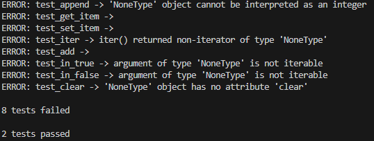
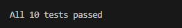

## Practice Test: Build a custom linked list named DsList (Data Structures List)

In this practice test, you must complete the implemention of the following DsList members.
```python

    # Append data to the end of the list
    def append(self, data):
        if self.head == None:
            self.head = Node(data)
            return
        current_node = self.head

        pass

    # count of nodes
    def __len__(self):
        pass
    
    # retrieve value of specific element 
    def __getitem__(self, index):
        pass

    # set data of specific element 
    def __setitem__(self, index, value):
        pass

    # provide ability to use DsList in a loop
    def __iter__(self):
        pass

    # provide ability to add two DsLists together
    # ds_list3 = ds_list1 + ds_list2
    def __add__(self, other):
        pass
        
    # provide ability to use the IN operator. e.g. if 'abc' in letters:
    def __contains__(self, value):
        pass
    
    # delete all elements
    def clear(self):
        pass

```

The only file you will modify will be ListModule.py.

You will run the app.py to check your progress.  There are 10 tests that must pass for full credit.

When starting, your test results will look like this.



When completed, your test results should look like this.



**Submission**
1. Once completed, you must maximize your vs code window, make sure test results are visible, and take a screenshot of your full desktop.

1. Upload screenshot to Canvas.

1. Push all changes back to GitHub.

1. Confirm your code changes are on GitHub.